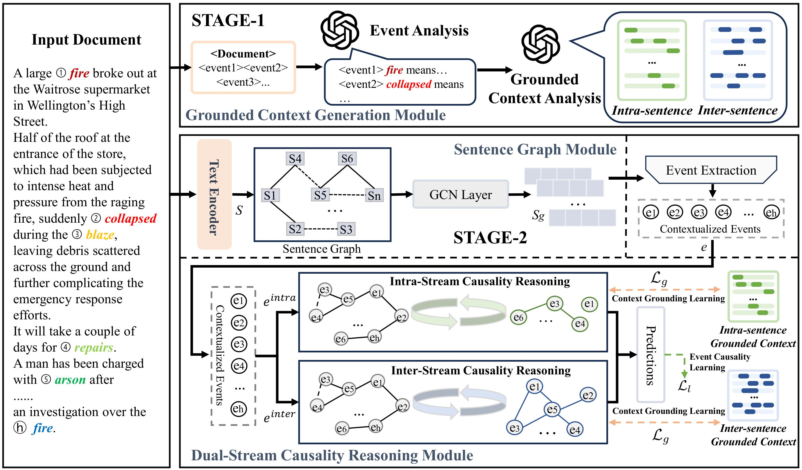

# Source Code of CogECI for Document-level Event Causality Identification

The official codes for "CogECI: Context Grounded Document-level Event Causality Identification via Large Language Models".

## Overview



## Quickstart (EventStoryLine v0.9)

### Environment

This project was originally developed with:

- Python 3.7.13
- PyTorch 1.11.0
- transformers 4.15.0

Install Python deps:

```bash
pip install -r requirements.txt
```

> Note on PyG: `torch_scatter` / `torch_geometric` installation depends on your PyTorch/CUDA version. If `pip install -r requirements.txt` fails, install the matching wheels following the official PyG install instructions, then re-run the requirements install.

Optional dependencies (only needed if you run the LLM data processing scripts):

```bash
pip install openai qianfan lxml networkx
```

### Data

This repo contains a processed EventStoryLine v0.9 dataset under `data/` for testing.

- Original dataset: [EventStoryLine](https://github.com/cltl/EventStoryLine/)
- Complete version: [EventStoryLine (complete)](https://github.com/tommasoc80/EventStoryLine/)

Training expects features cached as:

- `data/database/exist/EventStoryLine_bert_intra_and_inter_train_features.pkl`
- `data/database/exist/EventStoryLine_bert_intra_and_inter_dev_features.pkl`

By default `main.py` reads features from `--cache_path` (see `parameter.py`).

### Train / Evaluate

Example command (EventStoryLine v0.9):

```bash
python main.py \
  --dataset_type EventStoryLine \
  --cache_path ./data/database/exist \
  --model_name ./model/bert-base-uncased \
  --t_lr 2e-5 --lr 1e-4 --w 0.6 --threshold 2 \
  --epoch 30 --batch_size 1 \
  --beta_intra 0.3 --beta_inter 0.7 \
  --max_iteration 9 --min_iteration 2 \
  --num_heads 4 --mlp_drop 0.4 \
  --seed 209 --gamma 2.0
```

Logs are written under `logout/` at runtime (this directory is intentionally not tracked in git).

## Optional: LLM-based data processing

LLM scripts are consolidated under:

- `llm/run_llm_processing.py`
- `llm/event_extension.py`
- `llm/compare_llm_outputs.py`

### About generated `.csv` files

Some LLM-assisted `.csv` files are **user-generated** and are not required to run the main training loop.

- By default, `data/process_esc_csr.py` and `data/process_all_csr.py` look for optional example files under:
  - `data/examples/llm/`
- If those files do not exist, the code will **fall back to all-zero sentence labels** (so training still runs).
- If you want to use your own generated files, set `COGECI_DATA_DIR` to point to your data folder layout.

### API keys

Do **not** hard-code keys in code. Use environment variables instead.

Copy and edit `.env.example` (do not commit your `.env`):

```bash
cp .env.example .env
```

### Generate sentence-selection labels (event pair → sentence indices)

```bash
python llm/run_llm_processing.py select-sentences \
  --provider openai \
  --model gpt-4o-mini \
  --base_url "$OPENAI_BASE_URL" \
  --api_key_env OPENAI_API_KEY \
  --features_pkl ./data/database/exist/EventStoryLine_bert_intra_and_inter_dev_features.pkl \
  --data_csv ./data/ESL_dev_gpt.csv \
  --out_csv ./data/llama3/llama3help_dev_sen.csv
```

### Compare two LLM outputs

```bash
python llm/compare_llm_outputs.py \
  --llm_file1 ./data/llama3/llama3help_train_sen.csv \
  --llm_file2 ./data/gpt4/gpt4help_train_more.csv \
  --out_diff_csv ./data/llm_difference_train.csv
```

## Acknowledge
Sincerely thanks to [***iLIF***](https://github.com/LchengC/iLIF) for their contributions to this study.
## Security

- Never commit API keys / access keys.
- `.env` is ignored by git; use `.env.example` as a template.

## Citation

If you find this work helpful, please cite the paper:

```bibtex
@article{

}
```
